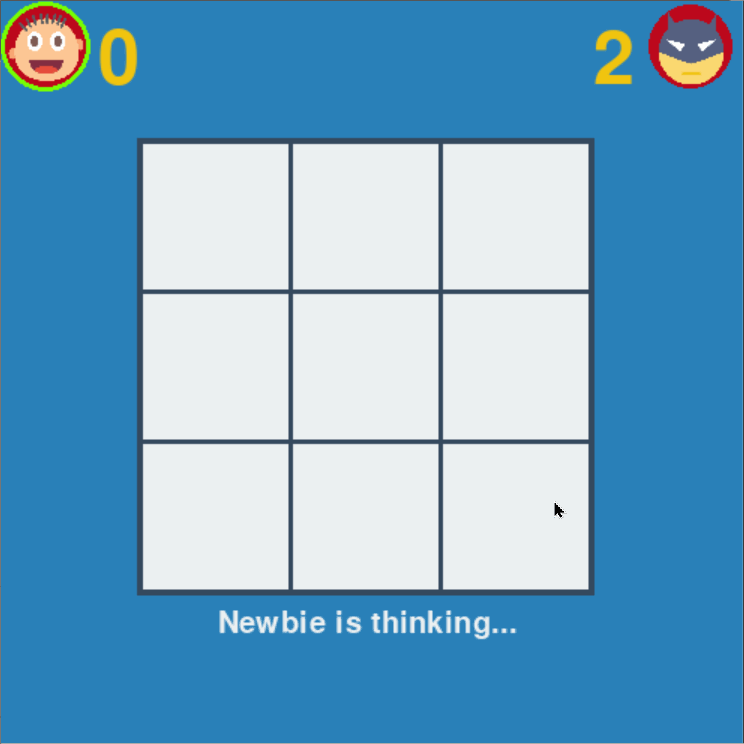
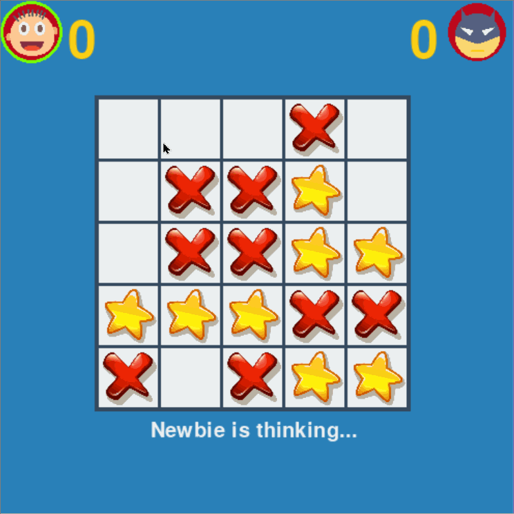

## Table of Contents

- [🤖 Tic-Tac-Toe Terminator](#-tic-tac-toe-terminator)
  - [🛠 Technology](#-technology)
  - [📸 Screenshots](#-screenshots)
  - [💾 Installation](#-installation)
  - [🎮 Tictactoe](#-tictactoe)
  - [🤝 Contributing](#-contributing)
  - [📜 License](#-license)
  - [💖 Show your support](#-show-your-support)

# 🤖 Tic-Tac-Toe Terminator

**Tic-Tac-Toe Terminator** is a computer player that uses the minimax algorithm to make its moves. This algorithm allows the A.I. to analyze the current state of the game and determine the best move to make in order to maximize its chances of winning.

The A.I. is designed to be unbeatable, meaning it will always either win or draw against a human opponent. To achieve this level of performance, the A.I. prunes unnecessary branches of the game tree to make its calculations more efficient.

## 🛠 Technology

- Python
- Pygame library
- Minimax algorithm

## 📸 Screenshots



## 💾 Installation

1. Install pygame library

```sh
pip install pygame
```

2. Run the program

```sh
python main.py
```

## 🎮 Tictactoe

**Tictactoe** game can also be played without engine.

- Inside **tictactoe** package, there are 3 modules:
  1. `board.py`: Game logics
  2. `gui.py`: Pygame interface
  3. `engine.py`: Algorithm
- You can play the 2 player mode in the console, by running the `python tictactoe/board.py`.
- You can also change the board size (4x4, 5x5, etc.). (_A.I. can only play 3x3 board currently_)
- By changing `MODE` in `main.py`, you can play the 2P version in pygame interface.



## 📜 License

This project is licensed under the [MIT](./LICENSE) license.

## 💖 Show your support

If you found this project interesting or helpful, please consider giving it a ⭐.
